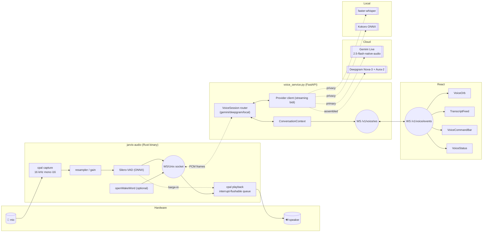

# ADR-0001: OpenJarvis real-time voice pipeline — clean-slate rebuild

- **Status:** Accepted (2026-04-22)
- **Deciders:** Project owner + Copilot coding agent
- **Supersedes:** all prior ad-hoc STT/TTS scaffolding under `src/openjarvis/speech/`,
  `src/openjarvis/tools/audio_tool.py`, `src/openjarvis/tools/text_to_speech.py`,
  `frontend/src/hooks/useSpeech.ts`, and the `/v1/speech/*` HTTP routes.

## Context

OpenJarvis shipped a batch-style speech stack: the browser recorded a full
utterance with `MediaRecorder`, POSTed the blob to `/v1/speech/transcribe`, and
the backend called a non-streaming STT provider. TTS was limited to writing
`mp3` artefacts to disk for the morning digest. There was no streaming, no VAD,
no wake word, no barge-in, and no persistent conversational session. The goal
is a production-grade speech-to-speech experience with natural interruptions,
sub-second time-to-first-audio, and a privacy-mode fallback.

## Audit of removed surface

### Python
- `src/openjarvis/speech/` (entire package — `_stubs.py`, `_discovery.py`,
  `tts.py`, `faster_whisper.py`, `openai_whisper.py`, `deepgram.py`,
  `cartesia_tts.py`, `kokoro_tts.py`, `openai_tts.py`, `__init__.py`).
- `src/openjarvis/tools/audio_tool.py` (`AudioTranscribeTool`).
- `src/openjarvis/tools/text_to_speech.py` (`TextToSpeechTool`).
- `SpeechRegistry`, `TTSRegistry` from `src/openjarvis/core/registry.py`.
- `SpeechConfig` and `voice_id` / `tts_backend` / `voice_speed` fields on
  `JarvisPersonaConfig` and `DigestConfig` in `src/openjarvis/core/config.py`.
- `speech_backend` plumbing in `system/core.py`, `system/builder.py`,
  `cli/serve.py`, `cli/registry_cmd.py`, `server/app.py`.
- `/v1/speech/transcribe` and `/v1/speech/health` routes in
  `server/api_routes.py`; `AudioMeta` in `server/models.py`; morning-digest
  audio endpoint in `server/digest_routes.py`.

### Frontend
- `frontend/src/hooks/useSpeech.ts`, `frontend/src/components/Chat/MicButton.tsx`,
  `frontend/src/components/Chat/AudioPlayer.tsx`.
- `transcribeAudio`, `fetchSpeechHealth` in `frontend/src/lib/api.ts`.
- `transcribe_audio`, `speech_health` Tauri commands in
  `frontend/src-tauri/src/lib.rs`.

### Dependencies
- `speech` and `speech-deepgram` extras in `pyproject.toml`.

### Tests
- `tests/speech/`, `tests/server/test_speech_routes.py`,
  `tests/tools/test_text_to_speech.py`.

## Decision

### Stack

| Tier | Mode | STT | LLM | TTS | Use case |
|---|---|---|---|---|---|
| **1. Primary (cloud S2S)** | `gemini-live` | Gemini Live | Gemini Live | Gemini Live native audio | Default; lowest latency; unlimited tier |
| **2. Cloud assembled** | `deepgram-aura` | Deepgram Nova-3 WS | existing LLM layer | Deepgram Aura-2 WS | Text-LLM workflows, cheapest cloud |
| **3. Local (privacy mode)** | `local` | faster-whisper (`small.en`) | local LLM | Kokoro ONNX | Zero egress |

- Primary model: `gemini-2.5-flash-preview-native-audio` with fallback to
  `gemini-2.0-flash-live-001`.
- Failover chain: `gemini-live → deepgram-aura → local`.
- OpenAI Realtime is **explicitly excluded for now** by user decision; the
  `VoiceSession` router keeps space for it but does not ship an adapter.

### Rationale

1. Gemini Live native audio is the only option delivering true speech-to-speech
   in a single WebSocket with sub-300 ms TTF, and the owner already has a
   reliable unlimited tier. One socket beats three hops.
2. Deepgram Nova-3 + Aura-2 is the lowest-latency assembled pipeline and the
   cheapest cloud path — useful for text-LLM workflows and for authoritative
   timestamped transcripts in the UI.
3. faster-whisper + Kokoro covers the privacy-first case at zero marginal cost.
4. All three expose the same `VoiceSession` interface so UI, Rust daemon, and
   conversation-state manager stay provider-agnostic.

### Non-functional targets

| Requirement | Target |
|---|---|
| End-to-end latency (end-of-speech → first TTS chunk), cloud | < 800 ms p50 |
| End-to-end latency, local | < 400 ms p50 |
| Mic capture → first PCM chunk on bus | < 50 ms |
| Barge-in detection | < 150 ms |
| Streaming in both directions | mandatory |
| Platform support | macOS primary, Linux required, Windows best-effort |
| Privacy mode | fully local, no network egress |
| Secret handling | encrypted at rest, never logged, never in git, local-only IPC |
| Graceful degradation | automatic failover on connection error / rate limit / high latency |

## Architecture

### Design invariants

- **One audio bus, two sockets.** The Rust daemon owns mic and speaker. Python
  never touches PortAudio. Tauri never touches PortAudio.
- **PCM on the wire.** Raw 16 kHz mono `i16` LE in 20 ms frames (640 bytes).
  No base64, no containers, no compression.
- **Barge-in.** VAD runs continuously including during TTS playback. On speech
  above threshold while playback is active, the Rust daemon flushes the
  playback queue locally and sends `user_interrupt` to Python, which cancels
  the provider stream.
- **Conversation context in Python**, not in the provider session, so it
  survives failover mid-conversation.
- **Secret handling.** Keys live in the encrypted config blob under
  `~/.openjarvis/`. React writes them through Tauri IPC (`set_secret`), never
  over HTTP. Python reads them from the same encrypted blob, never from
  `os.environ`. The Rust daemon never sees keys.
- **Streaming-first everywhere.** No full-utterance buffering at any stage.

## Phase plan

1. **Phase 1 — Demolition.** Delete the surface listed above, strip deps,
   commit `chore: eradicate legacy voice pipeline — clean slate`.
2. **Phase 2 — Config & secrets.** New `VoiceConfig` (mounted at `config.speech`
   so it auto-populates the schema-driven Speech Settings tab), encrypted key
   store, Tauri IPC, Settings UI with provider dropdown and Cloud/Local toggle.
3. **Phase 3 — Rust `jarvis-audio`.** cpal capture+playback, Silero-VAD,
   Unix/WS server, barge-in flush, feature-gated wake word.
4. **Phase 4 — Python `voice_service`.** `VoiceSession` router + providers +
   failover + `/v1/voice/ws` + context manager + barge-in propagation.
5. **Phase 5 — React UI.** Orb, transcript feed, command bar, status; WebAudio
   visualisation only.

## Risks

| Risk | Mitigation |
|---|---|
| Gemini Live preview shape changes | Thin adapter, failover chain hides it |
| Morning digest previously depended on non-streaming TTS | Digest audio is dropped per user decision; can be reintroduced on the new provider layer if needed |
| Rust daemon mic permission on macOS | Daemon is a separate process spawned by Tauri with TCC entitlement; health-check probe before enabling voice UI |
| Preview models may disappear | Failover chain + pinned model list in `VoiceConfig` |
